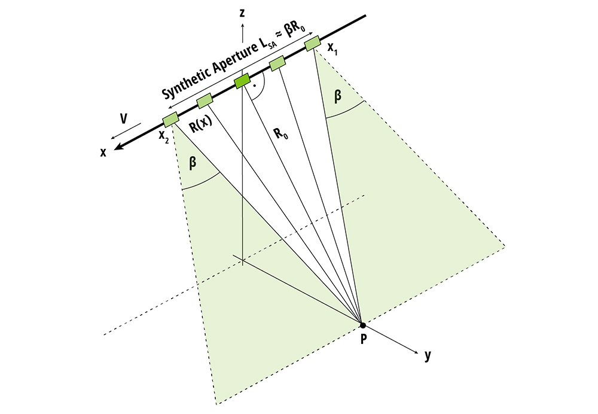
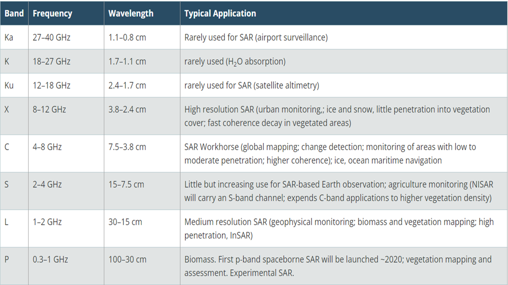
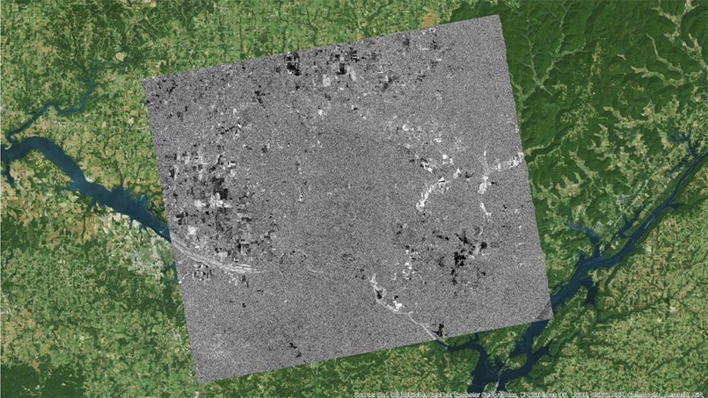
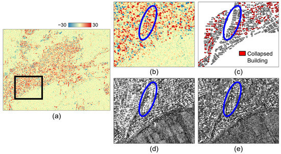
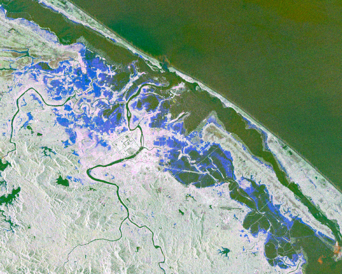

```{r include=FALSE}
library(RefManageR)
library(knitcitations)
BibOptions(check.entries = FALSE,
           bib.style = "authoryear",
           cite.style = "authoryear",
           style = "markdown",
           hyperlink = TRUE,
           dashed = FALSE,
           no.print.fields=c("doi", "url", "urldate", "issn"))
myBib <- ReadBib("References.bib", check = FALSE)

```

# Overview
SAR is a type of **active senso**r which produces its own energy and records the energy reflected from the Earth

.pull-left[- Advantages:
  - High resolution
  - Independent of weather condition
  - Capability to penetrate clouds & vegetation


- Limitation:
  - Speckle noise - difficult to interpret the images
  - Limited temporal resolution
  - Dependence on antenna size
] 

```{r echo=FALSE, out.width='50%', out.height= '50%', fig.align='right'}


```
.small[(Source: [NASA](https://www.earthdata.nasa.gov/learn/backgrounders/what-is-sar))
]

---
# The Frequency and Wavelength of SAR

```{r echo=FALSE, out.width= "75%", fig.align='left'}

```
Frequency and Wavelength of SAR (Source: [NASA](https://www.earthdata.nasa.gov/learn/backgrounders/what-is-sar))
---
class: inverse, center, middle

#Application
---

# Application - Forest Mapping

SAR has been widely applied in forestry sector due to its ability to penetrate through clouds and foliage, providing all-weather and day-night imaging capabilities

.pull-left[
- **Forest Change Detection**: 

SAR can capture deforestation and forest degradation by identifying changes in the backscatter of radar signals from the forest canopy `r Citep(myBib, "kellndorfer2019using")`

- **Forest Carbon Change**: 

Forest carbon variations can be estimated by using InSAR to measure changes in the height of the forest canopy. `r Citep(myBib, "solberg2015monitoring")`
] 

```{r echo=FALSE, out.width='53%', out.height='70%',  fig.align='right'}


```
.small[Forest mapping (Source: [NASA Earth Data](https://www.earthdata.nasa.gov/learn/webinars-and-tutorials/getting-started-with-sar))]

---
# Application - Infrastructure Monitoring

SAR data can be used to monitor urban infrastructure such as buildings, bridges, and roads, detect structural changes and deformations, assess damage caused by natural disasters, and monitor urban growth and development

.pull-left[
- **Bridge Monitoring**: 

By utilizing InSAR technology with high spatial resolution data, it is possible to conduct a comprehensive survey on numerous bridges, which can facilitate the identification of anomalies `r Citep(myBib, "sartorelli2021use")`

- **Damaged Building Detection**: 

Earthquake-induced damaged buildings can be detected by using bi-temporal SAR data obtained in different observation modes. `r Citep(myBib, "kim2023detection")`
] 
```{r echo=FALSE, out.width='53%', out.height='70%',  fig.align='right'}


```
.small[Damaged Building Detection (Source: [Kim, Park, and Lee, 2023](https://www.mdpi.com/2072-4292/15/2/308)]

---
# Application - Geology

SAR can be applied in the context of geology for various purposes such as mapping terrain and land cover, detecting changes in land surface elevation, and monitoring natural hazards such as earthquakes, volcanic eruptions, landslides, and floods

.pull-left[
- **Natural Hazard Mapping**: 

The combination of SAR images using interferometric, polarimetric and tomographic processing allows for the monitoring and characterization of natural hazards regardless of weather conditions. `r Citep(myBib, "lu2010radar")`

- **Flood Mapping**: 

The large spatial coverage of SAR data provided relative spatial distribution information on the typhoon impacts in Japan  `r Citep(myBib, "tay2020rapid")`
] 
```{r echo=FALSE, out.width='53%', out.height='70%',  fig.align='right'}


```
.small[Flood Detection Map (Source: [NASA](https://appliedsciences.nasa.gov/our-impact/news/esa-copernicus-sentinel-1-sar-used-flood-detection-maps))]
---

# Reflection

- The research on SAR sensor enabled me to understand its benefits and limitation. Its continuous imaging of the Earth's surface was fascinating

- However, the complexity of interpretation of the data still remains as a challenge, which requires knowledge and experience

- Although SAR data have been widely used in various sectors, it seems that its **application in urban environment is somehow limited** 

- *My Question...*
  
  - Does collecting data at longer wavelengths result in a **difference in images' resolution** compared to *those obtained at visible wavelengths?*
  
  - Can SAR data be applied to better understand wildlife?
  
- For the future exploration, I would love to study more about the use of SAR in combination of other remote sensing technologies which would enrich what SAR can offer us!


---

# References
```{r bibliography, results='asis', echo=FALSE, warning=FALSE}
PrintBibliography(myBib
                  , start = 1, end = 5
                  )
```

---
# References

```{r bibliography2, results='asis', echo=FALSE, warning=FALSE}
PrintBibliography(myBib
                  , start = 6, end =8
                  )
```
